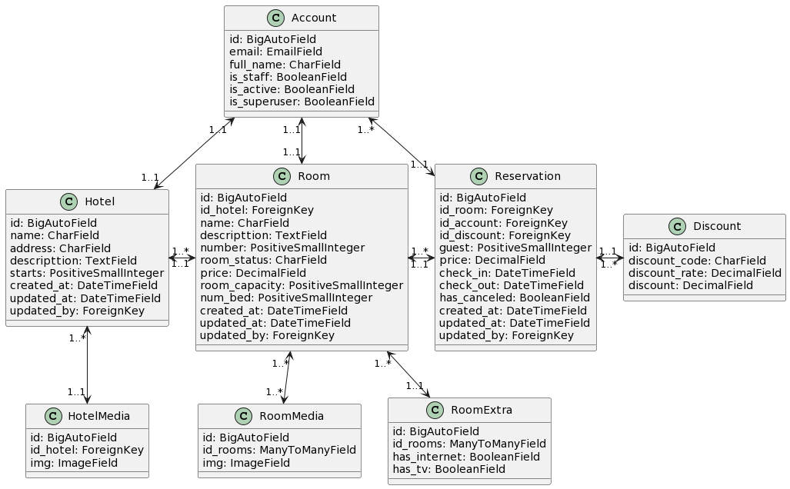

# HOTEL SOLUTIONS HUB

Project for the management hotel, rooms and reservations.

## UML
**NOTE:** Please note that this is a simplified representation, and actual models might be more complex depending on your application's requirements. You can inspect the database schema generated by running `makemigrations` and `migrate` commands to see the exact table names and relationships in a real Django project.

